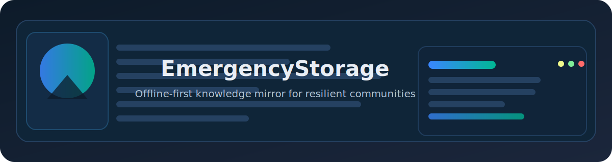
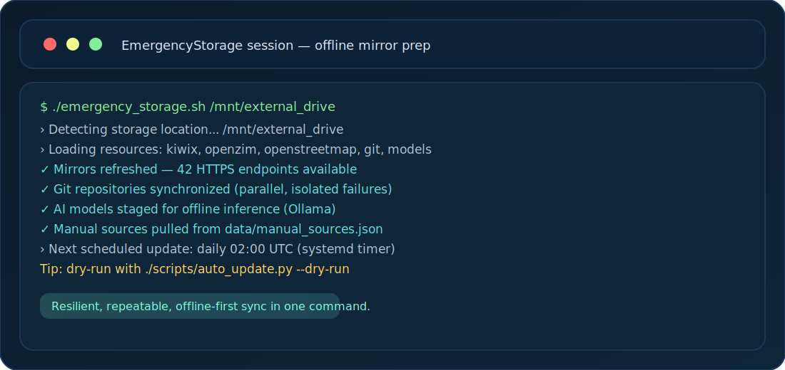

# EmergencyStorage

<p align="center">
  
</p>

<p align="center">
  <a href="https://github.com/VictoKu1/EmergencyStorage/actions/workflows/ci.yml?query=branch%3Amain">
    
  </a>
  <a href="https://github.com/VictoKu1/EmergencyStorage/actions/workflows/update-mirrors.yml">
    
  </a>
  <a href="https://github.com/VictoKu1/EmergencyStorage/releases">
    
  </a>
  <a href="https://github.com/VictoKu1/EmergencyStorage/commits">
    
  </a>
  <a href="LICENSE">
    
  </a>
</p>

> **Project status:** Active maintenance — focused on reliable, offline-first mirroring for preparedness scenarios.

EmergencyStorage is a modular toolkit that mirrors critical knowledge (Kiwix, OpenZIM, OpenStreetMap, Internet Archive collections, Git repositories, and Ollama models) onto external storage. It is built for Raspberry Pi or any Linux PC so communities can keep learning, mapping, and AI assistance available when connectivity is down.

## ✨ Key Features

- **Multiple Data Sources**: Kiwix, OpenZIM, OpenStreetMap, Internet Archive (software, music, movies, texts)
- **AI Models Storage**: Download and manage local AI models using Ollama for offline usage
- **Modular Design**: Each source has its own script for easy maintenance
- **Automatic Updates**: Schedule automatic resource updates with configurable frequency and resource selection
- **Dynamic Mirror Management**: Auto-updated mirror lists every 24 hours via GitHub Actions
- **Manual Source Downloads**: Configure and download from specific URLs with smart update control
- **Git Repositories Manager**: Clone and update multiple Git repositories in parallel with error isolation
- **Professional Logging**: Color-coded output with comprehensive error handling
- **Flexible Usage**: Download all sources or select specific ones
- **Resume Support**: Picks up where it left off if interrupted

## 🎥 Visual Demo



## 🚀 Quick Start

### Recommended Hardware

**Raspberry Pi**: Raspberry Pi 5 (recommended) or Raspberry Pi 4 Model B (4GB+)  
**Storage**: 15TB+ external HDD with USB 3.0 dock or SATA HAT  
**Power**: Official power supply for Pi; independent power for drives  
**Cooling**: Heatsink and fan recommended for sustained I/O operations  
See **[Hardware Guide](docs/HARDWARE.md)** for detailed specifications.

### Installation

```bash
# Install dependencies
sudo apt update
sudo apt upgrade
sudo apt install rsync curl wget python3 python3-venv python3-pip

# Clone the repository
git clone https://github.com/VictoKu1/EmergencyStorage.git
cd EmergencyStorage

# Make scripts executable
chmod +x emergency_storage.sh scripts/*.sh

# Optional: Set up automatic updates (recommended)
./scripts/setup_auto_update.sh
```

The optional automatic update setup will:
- Configure daily automatic resource updates (persists through system restarts)
- Let you choose your preferred update schedule
- Use systemd timers for reliable scheduling on Linux

### Basic Usage

```bash
# Download all sources to current directory (includes git repositories)
./emergency_storage.sh

# Download all sources to external drive (includes git repositories and AI models)
./emergency_storage.sh /mnt/external_drive

# Download specific source only
./emergency_storage.sh --kiwix /mnt/external_drive
./emergency_storage.sh --openzim /mnt/external_drive
./emergency_storage.sh --openstreetmap /mnt/external_drive

# Download AI models using Ollama (installs Ollama if needed)
./emergency_storage.sh --models /mnt/external_drive

# Clone/update Git repositories only
./emergency_storage.sh --git /mnt/external_drive

# Download from manual sources configuration (must be explicitly selected)
./emergency_storage.sh --manual-sources /mnt/external_drive

# Or use the manual sources script directly
python3 scripts/download_manual_sources.py

# Clone/update Git repositories directly
python3 scripts/download_git_repos.py

# Download AI models directly
./scripts/models.sh /mnt/external_drive

# Show help
./emergency_storage.sh --help
```

### Automatic Updates

```bash
# Run the automated setup (one-time)
./scripts/setup_auto_update.sh

# Or run updates manually
python3 scripts/auto_update.py

# Update specific resources
python3 scripts/auto_update.py --resource1 --resource2

# Dry run to test configuration
python3 scripts/auto_update.py --dry-run
```

The setup script configures systemd timers that:
- ✅ Run automatically on your chosen schedule
- ✅ Persist through system restarts
- ✅ Start automatically on boot
- ✅ Catch up on missed runs if system was off

See [Automatic Updates Documentation](docs/AUTO_UPDATE.md) for more details.

## ⚙️ Configuration

- **Storage target**: Pass the destination path to `emergency_storage.sh` (defaults to current directory).
- **Auto-update settings**: `data/auto_update_config.json` controls resources, schedules, and global behaviors used by `scripts/auto_update.py`.
- **Manual sources**: `data/manual_sources.json` defines custom URLs and commands for `--manual-sources` runs.
- **Git repositories**: `data/git_repositories.json` lists repos cloned by `--git` or the default `--all` mode.
- **AI models**: `data/Ollama.json` lists available models; `scripts/models.sh` sets the `OLLAMA_MODELS` path automatically.
- **Mirrors**: `data/mirrors/kiwix.json` is refreshed by GitHub Actions to keep Kiwix endpoints current.
- **Environment**: The scripts rely on standard Linux tools (curl, rsync, wget, python3). Optional `shellcheck` is useful for linting contributors.

## 📖 Documentation

Comprehensive documentation is available in the [`docs/`](docs/) folder:

- **[Installation Guide](docs/INSTALLATION.md)** - Detailed setup instructions and prerequisites
- **[Hardware Guide](docs/HARDWARE.md)** - Recommended hardware specifications and compatibility
- **[Usage Guide](docs/USAGE.md)** - Complete usage examples and tips
- **[Automatic Updates](docs/AUTO_UPDATE.md)** - Schedule and automate resource updates
- **[Architecture](docs/ARCHITECTURE.md)** - System design and project structure
- **[Storage Requirements](docs/STORAGE.md)** - Size estimates and content descriptions
- **[Contributing](docs/CONTRIBUTING.md)** - How to contribute and development workflow
- **[Adding Data Sources](docs/ADDING_SOURCES.md)** - Template system for new sources
- **[Error Handling](docs/ERROR_HANDLING.md)** - Logging and error management
- **[Mirror System](docs/MIRROR_SYSTEM.md)** - Dynamic mirror management details
- **[Manual Sources](docs/MANUAL_SOURCES.md)** - Configure manual download sources
- **[Git Repositories](docs/GIT_REPOSITORIES.md)** - Clone and manage Git repositories in parallel
- **[AI Models](docs/AI_MODELS.md)** - Download and manage local AI models using Ollama

## 📦 Available Data Sources

| Source | Size | Description |
|--------|------|-------------|
| **Kiwix** | ~7TB (10TB for complete repository) | Complete offline Wikipedia and educational content |
| **OpenZIM** | ~1TB | Compressed offline content (Wikipedia, educational materials) |
| **OpenStreetMap** | ~70GB | Complete planet mapping data |
| **IA Software** | 50GB-500GB | Preserved software, games, and applications |
| **IA Music** | 100GB-1TB | Music, podcasts, and live concerts |
| **IA Movies** | 500GB-5TB | Public domain films and documentaries |
| **IA Texts** | 100GB-2TB | Books, research papers, and academic texts |
| **AI Models** | 5GB-500GB | Local AI models (LLMs, code assistants, embeddings) |

**Recommended Storage**: 10-17TB+ for all sources

## 🛠️ Available Options

```bash
--all              # Download from all sources (default, includes git repositories and AI models)
--kiwix            # Kiwix mirror only
--openzim          # OpenZIM files only
--openstreetmap    # OpenStreetMap data only
--ia-software      # Internet Archive software only
--ia-music         # Internet Archive music only
--ia-movies        # Internet Archive movies only
--ia-texts         # Internet Archive texts only
--git              # Git repositories only
--models           # AI models using Ollama (installs if needed)
--manual-sources   # Manual JSON sources only (must be explicitly selected)
```

## 🗺️ Roadmap

- Publish tagged releases with changelog updates (SemVer) and downloadable artifacts.
- Add optional Docker image for quick evaluation on desktop servers.
- Expand example configurations for education- and health-focused bundles.
- Continue growing mirror lists and validation to keep downloads resilient.

## 📦 Versioning & Releases

- Uses **Semantic Versioning (SemVer)** for tagged releases.
- Release notes are tracked in [CHANGELOG.md](CHANGELOG.md); pre-1.0 releases may group breaking changes together.
- GitHub Releases will host packaged artifacts as they become available.

## 🤝 Contributing

We welcome contributions! See [CONTRIBUTING.md](CONTRIBUTING.md) and [Code of Conduct](CODE_OF_CONDUCT.md) before submitting PRs or issues.

## 🔒 Security

Please review [SECURITY.md](SECURITY.md) for vulnerability reporting guidance. If you discover a potential issue, contact the maintainers privately before opening a public issue.

## 📄 License

MIT License - see [LICENSE](LICENSE) file for details

---

**Need Help?** Check the [documentation](docs/) or [open an issue](https://github.com/VictoKu1/EmergencyStorage/issues)
